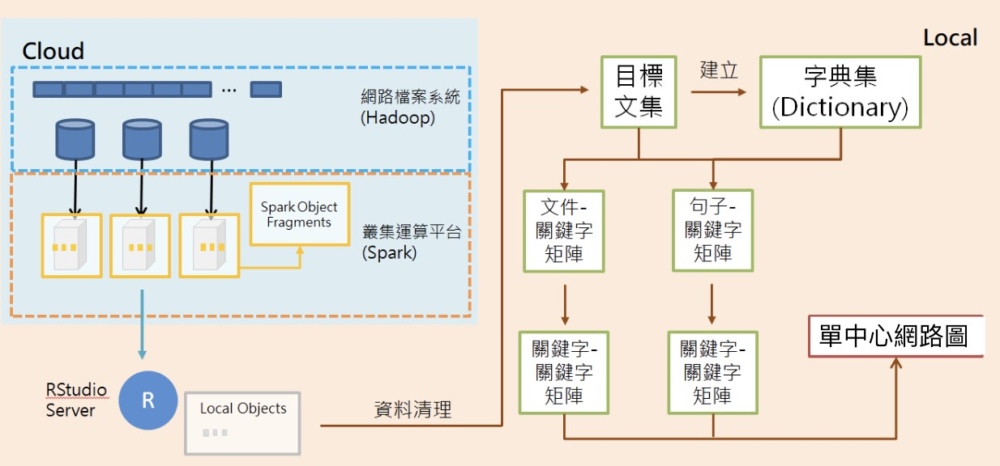
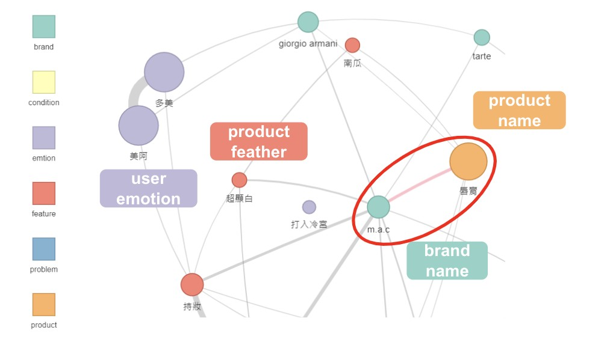
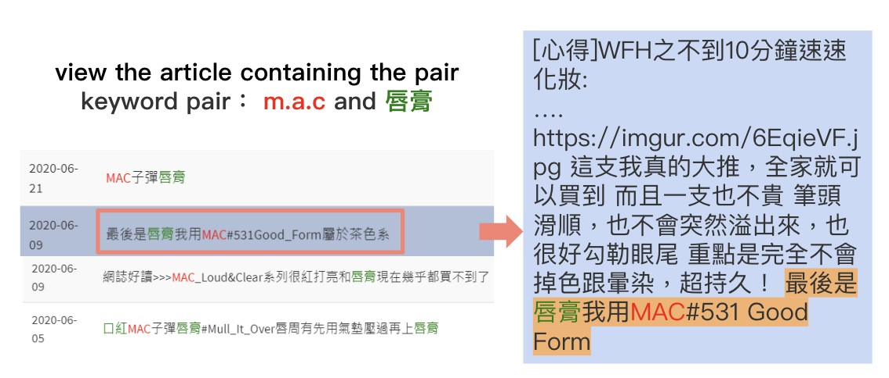

### Description

This project is for the BigVis seminar held by National Sun Yat-sen University in 2021.

In this project, we analyzed a 600 million-article text network on MakeUp board (PTT) and developed an interactive front-end interface for effective data visualization with SparkR and shiny app.

### Related links
+ [Slides of BigVis](https://drive.google.com/file/d/1Z_SfXEZtsx0edYhgUGCsfeqxdolwyCuc/view?usp=sharing)

### Tools
+ R, shiny app, sparkR

### Data processing workflow

#### 1. Preprocess in cloud
We use hadoop to preprosess the vast amount of the documents in cloud server, in this step, we exlude documents which are too short, and calculate the importance of the word by tf-idf.

#### 2. Local server
In this step, after we get the importance of the words:

1. We choose words with high tfidf and categorized them into six category, the details of the categories would be explained below.
2. Build word-sentences and word-document matrix to create the brand-centric network. The nodes are words, and the edges are in two types, they can be the time co-occurance of the word pair or the correlation of the words.

### How to use

#### Create the network
1. Choose the brand on the left side bar
2. Choose the number of the nodes displayed on the web page (4 ~ 32 nodes)
3. Choose the relation type of the edges (correlation / co-occurance)
4. Choose the threshold of the word relation, only the word pairs which have the relation higher than the threshold would be displayed on the page.

#### View the article

1. Click on the edge of the word pair which you are interested. and the sentences containing the word pair would be displayed on the bottom right side bar.
2. The sentences would be sorted by post date, and by clicking the sentence, the full article would be show in the buttom left side bar.

### Interactive interface

#### Network

##### The category of the keywords
+ `brand`: Name of the makeup brand, like `m.a.c`, `benifit`, `dior`
+ `feature`: Features of the product, like `持久力`, `廣感`, `自然光`
+ `product`: Name of the makeup product, like `染眉膏`, `眉筆`, `口紅`
+ `condition`: Product trial effect, like `致痘`, `偏乾`, `卡粉`
+ `problem`: The user's makeup concerns while applying makeup,like `黑眼圈`, `乾肌`, `油肌`
+ `emotion`: Emotion of the user, like `心動`, `必買`, `燒到`

#### Article bar

The article and sentences containing the word pair would be displayed in this format.